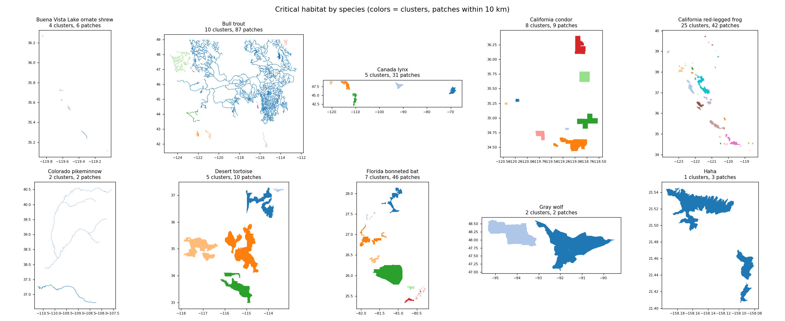
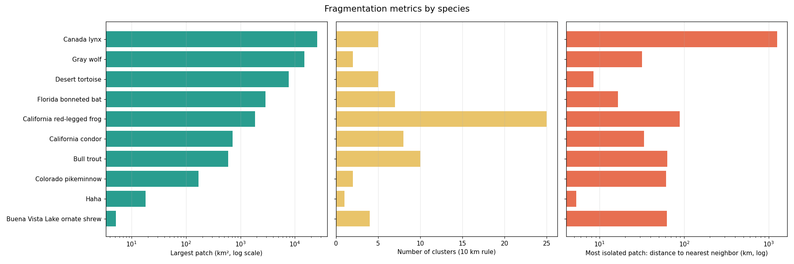
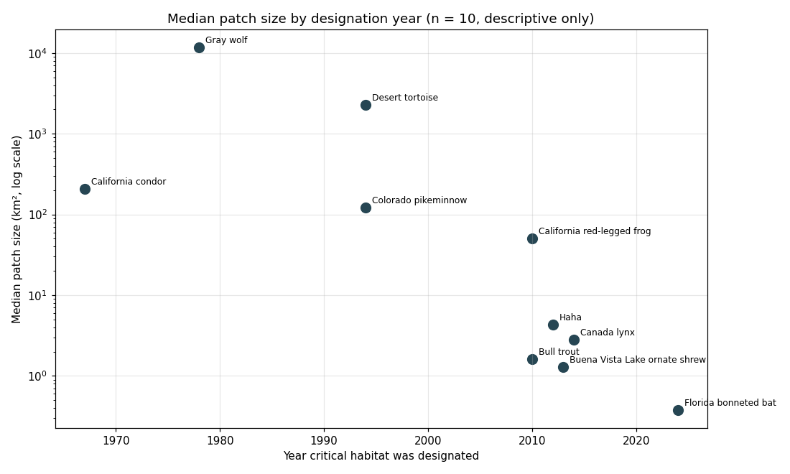

# Habitat Fragmentation Analysis for Threatened and Endangered Species

A geospatial analysis of how the designated critical habitat of 10 U.S. threatened and endangered species is broken into separate fragments, using the U.S. Fish & Wildlife Service (FWS) Critical Habitat dataset. The Python pipeline reads each species' habitat boundaries, measures fragment sizes, groups nearby fragments into clusters, and quantifies how isolated and spread out each species' habitat is, then compares species by taxonomic group, habitat type, and the year their habitat was designated.

**Tech stack:** Python · NumPy · SciPy (k-d trees) · pandas · Matplotlib · spherical geometry · KML · Google Earth Pro · Excel

Originally completed as the final project for INFOST 582G (Introduction to Data Science), University of Wisconsin–Milwaukee, Spring 2025. The code in this repository was rewritten in 2026; the original report is included in [`docs/`](docs/Habitat_Fragmentation_Report.pdf).



## Key Findings

- **Habitat size varies 10,000-fold across species.** The Buena Vista Lake ornate shrew has about 10 km² of critical habitat in total, split across 6 patches spread over 147 km, while the Canada lynx has about 100,600 km².
- **Later designations are much more fragmented.** The median patch size falls from 3,567 km² for species designated in 1960–2000, to 18.8 km² for 2001–2012, and to 1.5 km² for 2013–2025. This supports the original report's conclusion, with the caveat that each period contains only 3 or 4 species.
- **The California red-legged frog is the most fragmented species by count,** with 42 separate patches forming 25 clusters along the California coast.
- **Isolation differs sharply between species.** One Canada lynx habitat unit is about 1,260 km from any other lynx habitat, while the desert tortoise's patches all lie within 9 km of a neighbor.
- **River species form long, branching corridors.** Bull trout habitat breaks into 87 patches spanning 944 km, and Colorado pikeminnow habitat consists of two separate river systems 61 km apart.



## Species Analyzed

| Species | Scientific name | Group | Habitat | Designated |
|---|---|---|---|---|
| Buena Vista Lake ornate shrew | *Sorex ornatus relictus* | Mammal | Marsh/wetlands | 2013 |
| Bull trout | *Salvelinus confluentus* | Fish | Cold freshwater | 2010 |
| Canada lynx | *Lynx canadensis* | Mammal | Boreal forest | 2014 |
| California condor | *Gymnogyps californianus* | Bird | Montane/cliff | 1967 |
| California red-legged frog | *Rana draytonii* | Amphibian | Marsh/wetlands | 2010 |
| Colorado pikeminnow | *Ptychocheilus lucius* | Fish | Cold freshwater | 1994 |
| Desert tortoise | *Gopherus agassizii* | Reptile | Arid | 1994 |
| Florida bonneted bat | *Eumops floridanus* | Mammal | Subtropical forest/urban | 2024 |
| Gray wolf | *Canis lupus* | Mammal | Mixed woodlands | 1978 |
| Haha | *Cyanea superba* | Plant | Tropical forest (Hawaii) | 2012 |

## Method

For each species, [`fragmentation.py`](fragmentation.py):

1. **Reads the habitat polygons** from the FWS KML file, streaming the XML so that large layers (the bull trout file is 110 MB with 2.8 million boundary points) never need to fit in memory at once.
2. **Computes geodesic areas** on a spherical Earth, subtracting holes, so that areas are not distorted by a flat map projection.
3. **Merges touching polygons into patches.** FWS often splits one continuous area into several management units, so polygons within 0.5 km of each other are treated as a single habitat fragment. Patches under 0.01 km² are dropped as digitizing slivers.
4. **Groups patches into clusters.** Patches within 10 km of each other belong to the same cluster (single-linkage clustering). Cluster counts at 5, 25, and 50 km are also reported to show how sensitive the result is to this choice.
5. **Measures isolation and spread.** Isolation is each patch's edge-to-edge distance to its nearest neighboring patch; extent is the distance between the two farthest-apart patches.

All distances are great-circle distances between boundaries, not between centers. To keep this fast on large layers, the script first estimates distances from bounding spheres and a coarse copy of each boundary, then computes precise distances with k-d trees only for the pairs that matter. Distances are accurate to within about 0.5 km.

## Results

Full results are in [`results/fragmentation_metrics.csv`](results/fragmentation_metrics.csv).

| Species | Patches | Clusters (10 km) | Total area (km²) | Largest patch (km²) | Median patch (km²) | Most isolated patch (km) | Extent (km) |
|---|---|---|---|---|---|---|---|
| Buena Vista Lake ornate shrew | 6 | 4 | 10 | 5.2 | 1.3 | 62 | 147 |
| Bull trout | 87 | 10 | 2,794 | 594 | 1.6 | 63 | 944 |
| Canada lynx | 31 | 5 | 100,629 | 25,670 | 2.8 | 1,262 | 3,680 |
| California condor | 9 | 8 | 2,449 | 713 | 206 | 34 | 174 |
| California red-legged frog | 42 | 25 | 6,638 | 1,841 | 50 | 88 | 681 |
| Colorado pikeminnow | 2 | 2 | 244 | 170 | 122 | 61 | 61 |
| Desert tortoise | 10 | 5 | 26,121 | 7,715 | 2,270 | 8 | 417 |
| Florida bonneted bat | 46 | 7 | 4,705 | 2,895 | 0.4 | 17 | 270 |
| Gray wolf | 2 | 2 | 23,335 | 15,031 | 11,667 | 32 | 32 |
| Haha | 3 | 1 | 24 | 18 | 4.3 | 5 | 10 |

### Change by designation period

| Period | Species | Avg. clusters | Avg. largest patch (km²) | Avg. median patch (km²) | Avg. smallest patch (km²) | Avg. extent (km) |
|---|---|---|---|---|---|---|
| 1960–2000 | 4 | 4.3 | 5,907 | 3,567 | 2,106 | 171 |
| 2001–2012 | 3 | 12.0 | 818 | 18.8 | 1.2 | 545 |
| 2013–2025 | 3 | 5.3 | 9,524 | 1.5 | 0.13 | 1,366 |

The average largest patch rebounds in the latest period because of the Canada lynx, which also drives the jump in extent; the median and smallest patch sizes, which are less sensitive to one large species, decline steadily.



## Comparison with the Original Analysis

The original 2025 analysis measured each species by hand in Google Earth Pro and recorded the results in Excel ([`data/original_analysis/`](data/original_analysis)). The full side-by-side comparison is in [`results/comparison_with_original.csv`](results/comparison_with_original.csv).

The two approaches agree closely where the measurement is well defined: the largest California condor fragment (715 vs. 713 km²), the largest Haha fragment (18 vs. 18.1 km²), and the cluster counts for the ornate shrew (4 vs. 4) and Florida bonneted bat (7 vs. 7). They differ mainly where the original analysis needed judgment calls: visual cluster boundaries (desert tortoise, 12 vs. 5), which areas counted as a single fragment (Canada lynx's largest fragment, 9,145 vs. 25,670 km²), and river habitat, which the original measured by waterway length rather than area. The scripted version makes each of these choices explicit and repeatable.

Original Google Earth Pro maps for each species are in [`images/`](images).

## How to Run

```
pip install -r requirements.txt
python run_analysis.py
pytest tests/
```

`run_analysis.py` writes all tables and charts to `results/`. Options include `--cluster-km` (default 10) and `--merge-km` (default 0.5).

The bull trout KML (110 MB) is too large for GitHub. Download the species' critical habitat shapefile package from the [FWS Critical Habitat portal](https://ecos.fws.gov/ecp/report/critical-habitat) or the [full shapefile archive](https://ecos.fws.gov/docs/crithab/crithab_all_shapefiles.zip), convert it to KML (for example, with Google Earth Pro or `ogr2ogr`), and save it as `data/kml/FCH_SALVELINUS_CONFLUENTUS_20101018.kml`. Without it, the script analyzes the other nine species.

## Repository Structure

```
├── fragmentation.py          # KML reading, geodesic geometry, fragmentation metrics
├── run_analysis.py           # Runs all species; writes tables and charts
├── tests/                    # Unit tests for area and distance calculations
├── data/
│   ├── species.csv           # Species list and metadata
│   ├── original_measurements.csv
│   ├── original_analysis/    # Original Excel workbook
│   └── kml/                  # FWS critical habitat boundaries
├── results/                  # Output tables and charts
├── images/                   # Original Google Earth Pro maps
└── docs/                     # Original project report (PDF)
```

## Limitations

- Ten species is a small sample, so the period and taxonomic comparisons are descriptive, not statistical.
- Designated critical habitat is a legal boundary, not a map of where a species actually lives or can move.
- Distance rules (0.5 km merge, 10 km clustering) are modeling choices; cluster counts at other distances are included in the results for comparison.
- Straight-line distances ignore real barriers such as dams, highways, and mountain ranges, which the original report discusses qualitatively.

## Data Source

U.S. Fish & Wildlife Service, [FWS Critical Habitat for Threatened and Endangered Species](https://catalog.data.gov/dataset/fws-critical-habitat-for-threatened-and-endangered-species-dataset) (shapefiles dated 2025-03-28). FWS data is a U.S. federal government work in the public domain.
